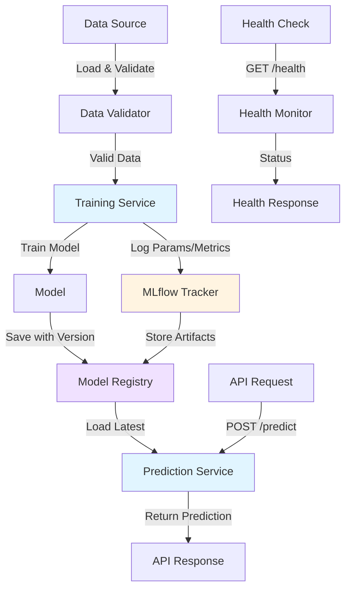
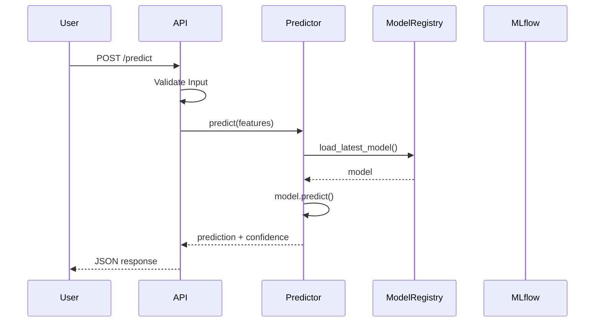

# Design Document: MLOps Pipeline Fix

## Overview

This design addresses critical bugs in an existing iris classification MLOps pipeline and establishes a robust, production-ready machine learning operations workflow. The system follows a modular architecture with clear separation between data management, model training, experiment tracking, and prediction serving.

The pipeline implements the complete ML lifecycle: data validation and loading, model training with MLflow experiment tracking, model persistence with versioning, and a FastAPI-based prediction service containerized with Docker. All components include comprehensive logging, error handling, and health monitoring.

### Key Design Decisions

1. **Fallback Data Loading**: Use sklearn's built-in iris dataset when CSV is empty/missing, ensuring the pipeline always has valid data
2. **MLflow for Experiment Tracking**: Centralized tracking of parameters, metrics, and artifacts for reproducibility
3. **Model Versioning with Timestamps**: Simple, filesystem-based versioning using ISO timestamps in filenames
4. **FastAPI for REST API**: Modern, async-capable framework with automatic OpenAPI documentation
5. **Graceful Degradation**: Health checks report model availability; service remains operational even if model loading fails

### MLOps Pipeline Flow



## Architecture

### System Components

The MLOps pipeline consists of four primary components:

1. **Data Management Layer** (`src/data_loader.py`)
   - Data loading from CSV or sklearn
   - Schema validation
   - Data quality checks

2. **Training Layer** (`src/train.py`)
   - Model training orchestration
   - MLflow experiment tracking
   - Model persistence with versioning

3. **Prediction Layer** (`src/predict.py`)
   - Model loading and caching
   - Prediction logic
   - Input validation

4. **API Layer** (`api/app.py`)
   - FastAPI REST endpoints
   - Request/response handling
   - Health monitoring

### Component Interactions



## Components and Interfaces

### 1. Data Loader Module (`src/data_loader.py`)

**Purpose**: Load and validate iris dataset from CSV or sklearn fallback.

**Functions**:

```python
def load_iris_data() -> tuple[pd.DataFrame, pd.Series]:
    """
    Load iris dataset with fallback mechanism.
    
    Returns:
        tuple: (features_df, target_series)
    
    Raises:
        ValueError: If data validation fails
    """
    
def validate_iris_dataframe(df: pd.DataFrame) -> bool:
    """
    Validate iris dataset structure and content.
    
    Args:
        df: DataFrame to validate
        
    Returns:
        bool: True if valid
        
    Raises:
        ValueError: If validation fails with descriptive message
    """
```

**Validation Rules**:
- Must have exactly 5 columns: sepal_length, sepal_width, petal_length, petal_width, species/target
- All feature columns must be numeric (float or int)
- Species column must contain only: setosa, versicolor, virginica (or 0, 1, 2)
- No null values allowed
- At least 10 rows required

**Loading Logic**:
1. Check if `data/iris.csv` exists and is non-empty
2. If yes, load CSV and validate
3. If no or validation fails, load from `sklearn.datasets.load_iris()`
4. Convert sklearn data to DataFrame with proper column names
5. Log which data source was used

### 2. Training Service (`src/train.py`)

**Purpose**: Train classification model with MLflow tracking and save versioned model.

**Refactored Structure**:

```python
# Configuration constants
DATA_PATH = Path("data/iris.csv")
MODEL_DIR = Path("models")
MLFLOW_TRACKING_URI = "http://127.0.0.1:5000"
EXPERIMENT_NAME = "iris-classification"

def setup_mlflow():
    """Initialize MLflow configuration once."""
    mlflow.set_tracking_uri(MLFLOW_TRACKING_URI)
    mlflow.set_experiment(EXPERIMENT_NAME)

def train_model(X_train, y_train, hyperparameters: dict):
    """Train logistic regression model."""
    model = LogisticRegression(**hyperparameters)
    model.fit(X_train, y_train)
    return model

def evaluate_model(model, X_test, y_test) -> dict:
    """
    Evaluate model and return metrics.
    
    Returns:
        dict: accuracy, precision, recall, f1_score, confusion_matrix
    """

def save_model_with_version(model, metrics: dict) -> Path:
    """
    Save model with timestamp version.
    
    Returns:
        Path: Path to saved model file
    """
    timestamp = datetime.now().strftime("%Y%m%d_%H%M%S")
    model_path = MODEL_DIR / f"iris_model_{timestamp}.pkl"
    joblib.dump(model, model_path)
    return model_path

def main():
    """Main training pipeline."""
    setup_mlflow()
    X, y = load_iris_data()
    X_train, X_test, y_train, y_test = train_test_split(...)
    
    with mlflow.start_run():
        model = train_model(X_train, y_train, hyperparameters)
        metrics = evaluate_model(model, X_test, y_test)
        
        # Log to MLflow
        mlflow.log_params(hyperparameters)
        mlflow.log_metrics(metrics)
        mlflow.sklearn.log_model(model, "model")
        
        # Save locally with versioning
        model_path = save_model_with_version(model, metrics)
        mlflow.log_param("model_path", str(model_path))
```

**Key Fixes**:
- Remove duplicate MLflow configuration (lines 11-12 and 35-36 in original)
- Consolidate MLflow setup into single function
- Add comprehensive metrics (precision, recall, F1, confusion matrix)
- Implement timestamp-based versioning
- Add structured logging

### 3. Prediction Module (`src/predict.py`)

**Purpose**: Load trained model and generate predictions.

**Implementation**:

```python
from pathlib import Path
import joblib
import numpy as np
from typing import Optional
import logging

MODEL_DIR = Path("models")
SPECIES_NAMES = ["setosa", "versicolor", "virginica"]

class ModelPredictor:
    """Handles model loading and predictions."""
    
    def __init__(self):
        self.model = None
        self.model_path = None
        
    def load_latest_model(self) -> bool:
        """
        Load the most recent model from MODEL_DIR.
        
        Returns:
            bool: True if model loaded successfully
        """
        try:
            model_files = sorted(MODEL_DIR.glob("iris_model_*.pkl"))
            if not model_files:
                logging.error("No model files found")
                return False
                
            self.model_path = model_files[-1]  # Latest by timestamp
            self.model = joblib.load(self.model_path)
            logging.info(f"Loaded model: {self.model_path}")
            return True
        except Exception as e:
            logging.error(f"Failed to load model: {e}")
            return False
    
    def predict(self, features: list[float]) -> dict:
        """
        Generate prediction with confidence scores.
        
        Args:
            features: [sepal_length, sepal_width, petal_length, petal_width]
            
        Returns:
            dict: {
                "prediction": species_name,
                "prediction_index": int,
                "confidence_scores": {species: probability}
            }
            
        Raises:
            ValueError: If model not loaded or invalid input
        """
        if self.model is None:
            raise ValueError("Model not loaded")
            
        if len(features) != 4:
            raise ValueError("Expected 4 features")
            
        features_array = np.array([features])
        prediction_idx = self.model.predict(features_array)[0]
        probabilities = self.model.predict_proba(features_array)[0]
        
        return {
            "prediction": SPECIES_NAMES[prediction_idx],
            "prediction_index": int(prediction_idx),
            "confidence_scores": {
                name: float(prob) 
                for name, prob in zip(SPECIES_NAMES, probabilities)
            }
        }
```

**Key Features**:
- Automatic loading of latest model by timestamp
- Confidence scores for all classes
- Comprehensive error handling
- Lazy loading pattern (load on first use)

### 4. FastAPI Application (`api/app.py`)

**Purpose**: REST API for model predictions and health checks.

**Fixed Structure**:

```python
from fastapi import FastAPI, HTTPException
from pydantic import BaseModel, Field
import logging
import sys
from pathlib import Path

# Add parent directory to path for imports
sys.path.append(str(Path(__file__).parent.parent))
from src.predict import ModelPredictor

# Configure logging
logging.basicConfig(level=logging.INFO)
logger = logging.getLogger(__name__)

# Initialize FastAPI app
app = FastAPI(
    title="Iris Classification API",
    description="MLOps pipeline for iris species prediction",
    version="1.0.0"
)

# Initialize predictor (module-level)
predictor = ModelPredictor()
model_loaded = False

@app.on_event("startup")
async def startup_event():
    """Load model on startup."""
    global model_loaded
    model_loaded = predictor.load_latest_model()
    if model_loaded:
        logger.info("Model loaded successfully")
    else:
        logger.warning("Failed to load model - predictions will fail")

# Pydantic models (module-level, outside any class)
class IrisInput(BaseModel):
    sepal_length: float = Field(..., gt=0, description="Sepal length in cm")
    sepal_width: float = Field(..., gt=0, description="Sepal width in cm")
    petal_length: float = Field(..., gt=0, description="Petal length in cm")
    petal_width: float = Field(..., gt=0, description="Petal width in cm")
    
    class Config:
        schema_extra = {
            "example": {
                "sepal_length": 5.1,
                "sepal_width": 3.5,
                "petal_length": 1.4,
                "petal_width": 0.2
            }
        }

class PredictionResponse(BaseModel):
    prediction: str
    prediction_index: int
    confidence_scores: dict[str, float]

class HealthResponse(BaseModel):
    status: str
    model_loaded: bool
    model_path: Optional[str]

# Route handlers (module-level, properly decorated)
@app.get("/health", response_model=HealthResponse)
async def health():
    """Health check endpoint."""
    return {
        "status": "healthy" if model_loaded else "degraded",
        "model_loaded": model_loaded,
        "model_path": str(predictor.model_path) if predictor.model_path else None
    }

@app.post("/predict", response_model=PredictionResponse)
async def predict(input_data: IrisInput):
    """Predict iris species from measurements."""
    if not model_loaded:
        raise HTTPException(
            status_code=503,
            detail="Model not available - service degraded"
        )
    
    try:
        features = [
            input_data.sepal_length,
            input_data.sepal_width,
            input_data.petal_length,
            input_data.petal_width
        ]
        
        result = predictor.predict(features)
        logger.info(f"Prediction: {result['prediction']}")
        return result
        
    except ValueError as e:
        logger.error(f"Validation error: {e}")
        raise HTTPException(status_code=400, detail=str(e))
    except Exception as e:
        logger.error(f"Prediction error: {e}")
        raise HTTPException(status_code=500, detail="Internal server error")
```

**Key Fixes**:
- Move Pydantic models to module level (not inside class)
- Move route handlers to module level with proper `@app` decorators
- Remove incorrect indentation
- Add startup event for model loading
- Add proper error handling with HTTP status codes
- Add request validation with Pydantic Field constraints
- Add response models for type safety

### 5. Docker Configuration (`api/Dockerfile`)

**Purpose**: Containerize the prediction service.

**Fixed Dockerfile**:

```dockerfile
FROM python:3.10-slim

WORKDIR /app

# Copy requirements and install dependencies
COPY requirements.txt .
RUN pip install --no-cache-dir -r requirements.txt

# Copy source code and models
COPY src/ ./src/
COPY api/ ./api/
COPY models/ ./models/

# Expose port
EXPOSE 8000

# Health check
HEALTHCHECK --interval=30s --timeout=3s --start-period=5s --retries=3 \
    CMD python -c "import requests; requests.get('http://localhost:8000/health')" || exit 1

# Run FastAPI with uvicorn
CMD ["uvicorn", "api.app:app", "--host", "0.0.0.0", "--port", "8000"]
```

**Key Fixes**:
- Remove `../` path references (use relative paths from build context)
- Copy entire `src/` directory for imports
- Copy `models/` directory for model files
- Add health check configuration
- Use port 8000 (standard for development)
- Add `--no-cache-dir` to reduce image size

**Build Context**: Dockerfile should be in project root or use proper context:
```bash
# Build from project root
docker build -f api/Dockerfile -t iris-api .
```

## Data Models

### Input Data Schema

**CSV Format** (`data/iris.csv`):
```csv
sepal_length,sepal_width,petal_length,petal_width,species
5.1,3.5,1.4,0.2,setosa
...
```

**Alternative Format** (numeric target):
```csv
sepal_length,sepal_width,petal_length,petal_width,target
5.1,3.5,1.4,0.2,0
...
```

### API Request/Response Models

**Prediction Request**:
```json
{
  "sepal_length": 5.1,
  "sepal_width": 3.5,
  "petal_length": 1.4,
  "petal_width": 0.2
}
```

**Prediction Response**:
```json
{
  "prediction": "setosa",
  "prediction_index": 0,
  "confidence_scores": {
    "setosa": 0.98,
    "versicolor": 0.01,
    "virginica": 0.01
  }
}
```

**Health Check Response**:
```json
{
  "status": "healthy",
  "model_loaded": true,
  "model_path": "models/iris_model_20240115_143022.pkl"
}
```

### Model Artifacts

**Model File Naming Convention**:
```
models/iris_model_{YYYYMMDD_HHMMSS}.pkl
```

**MLflow Artifact Structure**:
```
mlruns/
  {experiment_id}/
    {run_id}/
      artifacts/
        model/
          model.pkl
          conda.yaml
          requirements.txt
      metrics/
        accuracy
        precision
        recall
        f1_score
      params/
        model_type
        max_iter
        random_state
```


## Correctness Properties

A property is a characteristic or behavior that should hold true across all valid executions of a system—essentially, a formal statement about what the system should do. Properties serve as the bridge between human-readable specifications and machine-verifiable correctness guarantees.

### Property 1: Data Validation Completeness

*For any* iris dataset DataFrame, validation should verify all structural requirements: exactly 5 columns with correct names (sepal_length, sepal_width, petal_length, petal_width, species/target), all feature columns contain numeric values, and species column contains only valid iris species identifiers (setosa/versicolor/virginica or 0/1/2).

**Validates: Requirements 1.2, 1.3, 1.4**

### Property 2: Validation Error Descriptiveness

*For any* invalid dataset that fails validation, the error message returned should contain specific information about which validation rule failed (e.g., "missing column", "non-numeric values", "invalid species").

**Validates: Requirements 1.5**

### Property 3: Training Artifacts Completeness

*For any* training run, the MLflow experiment tracker should contain all required artifacts: hyperparameters (model_type, max_iter, random_state), metrics (accuracy, precision, recall, f1_score), the trained model artifact, and the model file path.

**Validates: Requirements 2.2, 2.4, 2.8.2**

### Property 4: Model Versioning Consistency

*For any* saved model file, the filename should follow the pattern `iris_model_{timestamp}.pkl` where timestamp is in YYYYMMDD_HHMMSS format, and all models should be stored in the same models/ directory.

**Validates: Requirements 8.1, 8.4**

### Property 5: Latest Model Selection

*For any* set of versioned model files in the model registry, when loading a model for prediction, the file with the most recent timestamp should be selected and loaded.

**Validates: Requirements 3.1, 8.3, 8.5**

### Property 6: Prediction Response Structure

*For any* valid input features (4 numeric values), the prediction response should contain three fields: "prediction" (species name string), "prediction_index" (integer 0-2), and "confidence_scores" (dictionary mapping all three species names to probability values that sum to 1.0).

**Validates: Requirements 3.3, 3.4**

### Property 7: Input Validation Enforcement

*For any* prediction request, if the input is missing any of the four required features (sepal_length, sepal_width, petal_length, petal_width) or contains non-numeric values, the service should reject the request with a 400 status code and validation error details.

**Validates: Requirements 3.2, 7.3**

### Property 8: HTTP Status Code Semantics

*For any* API request, the response status code should correctly reflect the outcome: 200 for successful operations, 400 for client input validation errors, 500 for server-side exceptions, and 503 for service degradation (model unavailable).

**Validates: Requirements 4.5**

### Property 9: Logging Level Appropriateness

*For any* operation in the MLOps pipeline, log messages should use appropriate levels: INFO for successful operations (model loaded, prediction made), WARNING for recoverable errors (model not found, falling back to sklearn data), and ERROR with stack traces for failures (training exception, prediction exception).

**Validates: Requirements 6.3, 6.4, 6.5**

### Property 10: Graceful Error Handling

*For any* file I/O error (missing file, permission denied, corrupted file), the system should catch the exception, log an appropriate error message without exposing system internals (file paths, stack traces in API responses), and return a user-friendly error message.

**Validates: Requirements 7.5**

## Error Handling

### Error Categories and Responses

**Data Loading Errors**:
- **Empty/Missing CSV**: Log warning, fallback to sklearn dataset, continue execution
- **Invalid CSV Schema**: Raise `ValueError` with specific validation failure details
- **Corrupted CSV**: Log error, fallback to sklearn dataset, continue execution

**Training Errors**:
- **Data Loading Failure**: Log error with stack trace, exit with code 1
- **Model Training Exception**: Log error with stack trace, exit with code 1
- **MLflow Connection Failure**: Log warning, continue training without tracking
- **Model Save Failure**: Log error, exit with code 1 (training incomplete)

**Prediction Errors**:
- **Model Not Found**: Return 503 status with message "Model not available"
- **Model Load Failure**: Return 503 status with message "Failed to load model"
- **Invalid Input**: Return 400 status with Pydantic validation details
- **Prediction Exception**: Return 500 status with generic error message, log full stack trace

**API Errors**:
- **Validation Error**: Return 400 with field-level validation details from Pydantic
- **Internal Exception**: Return 500 with generic message, log full exception
- **Model Unavailable**: Return 503 with degraded service message

### Error Logging Strategy

All errors should be logged with:
- Timestamp (ISO 8601 format)
- Log level (INFO, WARNING, ERROR)
- Component name (data_loader, train, predict, api)
- Error message
- Stack trace (for ERROR level only)

Example logging configuration:
```python
logging.basicConfig(
    level=logging.INFO,
    format='%(asctime)s - %(name)s - %(levelname)s - %(message)s',
    datefmt='%Y-%m-%d %H:%M:%S'
)
```

### Graceful Degradation

The prediction service should remain operational even when:
- Model file is missing (health endpoint returns "degraded" status)
- MLflow server is unavailable (training continues without tracking)
- CSV file is empty (falls back to sklearn dataset)

Health check response indicates degradation:
```json
{
  "status": "degraded",
  "model_loaded": false,
  "model_path": null
}
```

## Testing Strategy

### Dual Testing Approach

This project requires both unit tests and property-based tests for comprehensive coverage:

- **Unit tests**: Verify specific examples, edge cases, and integration points
- **Property tests**: Verify universal properties across randomized inputs

Both testing approaches are complementary and necessary. Unit tests catch concrete bugs in specific scenarios, while property tests verify general correctness across a wide input space.

### Property-Based Testing Configuration

**Library Selection**: Use `hypothesis` for Python property-based testing

**Test Configuration**:
- Minimum 100 iterations per property test (due to randomization)
- Each property test must reference its design document property
- Tag format: `# Feature: mlops-pipeline-fix, Property {number}: {property_text}`

**Example Property Test Structure**:
```python
from hypothesis import given, strategies as st
import pytest

# Feature: mlops-pipeline-fix, Property 1: Data Validation Completeness
@given(
    df=st.dataframes(
        columns=st.sampled_from([
            ['sepal_length', 'sepal_width', 'petal_length', 'petal_width', 'species'],
            ['a', 'b', 'c'],  # wrong columns
            ['sepal_length', 'sepal_width', 'petal_length', 'petal_width', 'species', 'extra']  # too many
        ]),
        rows=st.integers(min_value=1, max_value=100)
    )
)
@pytest.mark.property_test
def test_data_validation_completeness(df):
    """Property 1: Data validation checks all structural requirements."""
    result = validate_iris_dataframe(df)
    # Verify validation logic...
```

### Unit Testing Strategy

**Test Organization**:
```
tests/
  test_data_loader.py      # Data loading and validation
  test_train.py            # Training pipeline
  test_predict.py          # Prediction logic
  test_api.py              # FastAPI endpoints
  test_integration.py      # End-to-end flows
```

**Key Unit Test Cases**:

1. **Data Loading**:
   - Test loading from valid CSV
   - Test fallback to sklearn when CSV is empty
   - Test fallback to sklearn when CSV is missing
   - Test validation with various invalid schemas

2. **Training**:
   - Test model training with valid data
   - Test MLflow logging (mock MLflow server)
   - Test model saving with timestamp
   - Test training failure handling

3. **Prediction**:
   - Test loading latest model from multiple versions
   - Test prediction with valid input
   - Test prediction with invalid input
   - Test behavior when model is missing

4. **API**:
   - Test /predict endpoint with valid request
   - Test /predict endpoint with invalid request
   - Test /health endpoint when model is loaded
   - Test /health endpoint when model is not loaded
   - Test proper HTTP status codes

5. **Integration**:
   - Test full pipeline: train → save → load → predict
   - Test Docker container build and run
   - Test API accessibility from container

### Testing Tools

- **pytest**: Test framework
- **hypothesis**: Property-based testing
- **pytest-cov**: Code coverage reporting
- **httpx**: FastAPI test client
- **pytest-mock**: Mocking for external dependencies (MLflow)

### Coverage Goals

- Minimum 80% code coverage
- 100% coverage for critical paths (prediction, validation)
- All correctness properties implemented as property tests
- All error handling paths covered by unit tests

### Continuous Testing

Tests should be run:
- Before each commit (pre-commit hook)
- On pull requests (CI pipeline)
- After deployment (smoke tests)

Example test command:
```bash
pytest tests/ --cov=src --cov=api --cov-report=html --hypothesis-profile=ci
```

Hypothesis profile configuration:
```python
# conftest.py
from hypothesis import settings, Verbosity

settings.register_profile("ci", max_examples=100, verbosity=Verbosity.verbose)
settings.register_profile("dev", max_examples=10)
settings.load_profile("dev")  # default for local development
```
